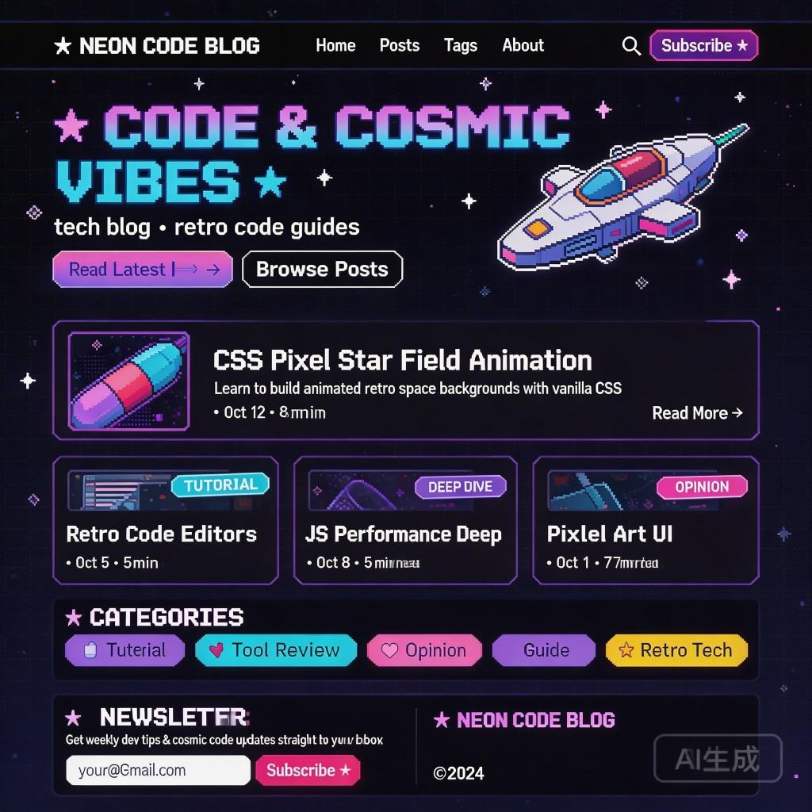

# ZZM Dev Blog — 样式风格指南

> 本文档是博客唯一的视觉设计基准。任何样式改动都应以此为参照。
> 如果你是 AI，请在修改任何 CSS / 布局之前先完整读完这篇文档。

---

## 参考设计图

下图是博客风格的视觉基准，所有样式决策均源自此图：



---

## 一句话描述

> **像素风 × 深宇宙暗色 × 现代博客布局**
>
> 视觉上像一个高质量独立像素游戏的 UI，信息结构上是标准的现代技术博客。
> 不复古土气，不过度 Q 版，保持工程师的专业感。

---

## 配色系统

### 背景层次

| 变量名 | 色值 | 用途 |
|--------|------|------|
| `--bg` | `#0d0b1e` | 全站主背景，极深的蓝紫黑 |
| `--bg-card` | `#13102a` | 卡片、浮层主背景 |
| `--bg-card2` | `#1a1535` | 卡片内次级背景，略亮一级 |

### 主色 / 强调色

| 变量名 | 色值 | 用途 |
|--------|------|------|
| `--pink` | `#e040fb` | 主强调色，用于渐变起点、重要 badge、hover 高亮 |
| `--cyan` | `#40c8ff` | 辅助强调色，渐变终点、链接 hover、代码关键词 |
| `--purple` | `#a855f7` | 三级强调，边框发光、series 标签 |
| `--yellow` | `#fbbf24` | 点缀色，Retro Tech 类 badge、星星装饰 |
| `--green` | `#34d399` | 辅助点缀，LLM / 已完结状态 |

### 文字层次

| 变量名 | 色值 | 用途 |
|--------|------|------|
| `--text` | `#e8e4f0` | 主文字，接近白色带一点紫调 |
| `--text-muted` | `#8a85a0` | 次级文字，摘要、描述 |
| `--text-dim` | `#5a5570` | 弱文字，时间、阅读时长、分隔符 |

### 边框

| 变量名 | 色值 | 用途 |
|--------|------|------|
| `--border` | `rgba(138,90,255,0.35)` | 默认边框，低调紫色 |
| `--border-bright` | `rgba(180,120,255,0.6)` | hover 状态边框，更亮 |

### 核心渐变

- **主按钮渐变**：`linear-gradient(135deg, #e040fb, #a855f7)` （粉紫）
- **标题渐变文字**：`linear-gradient(90deg, #e040fb, #40c8ff)` （粉 → 青）
- **背景光晕**：`radial-gradient(ellipse, rgba(168,85,247,0.18), transparent)` 大椭圆，居中/偏上方

---

## 字体系统

### 字体家族

| 用途 | 字体 | 引入方式 |
|------|------|----------|
| 像素风标题、按钮、导航 LOGO | `Press Start 2P` | Google Fonts |
| 正文、摘要、元信息、文章内容 | `Inter` | Google Fonts |
| 代码块 | `Fira Code` 或系统 `monospace` | 系统字体回退 |

### 使用规则

- `Press Start 2P` **只用在** Hero 大标题、区块标题（如 `★ RECENT POSTS`）、按钮文字、导航 LOGO。
- **正文绝对不使用** `Press Start 2P`，可读性差、排版费力。
- 文章内 `h2 / h3` 等标题使用 `Inter`（或系统无衬线），font-weight 700。
- 代码使用等宽字体，不混用像素字体。

---

## 形状与圆角

- **默认圆角**：`6px`（小元素，badge、按钮、小卡片）
- **大圆角**：`10px`（主卡片、代码块、封面图）
- **不使用 `border-radius: 0`**：避免完全方角，会显得粗糙
- **不使用 `border-radius > 12px`**：过度圆角会失去像素气质
- **像素感来源不是方角**，而是 `Press Start 2P` 字体 + 偏暗的配色 + 细描边卡片

---

## 装饰元素

### 星空背景

- JS 动态生成约 80 个小白点，随机分布于 `position: fixed` 的容器内
- 每个点有独立的 `twinkle` 动画（透明度 0→随机值→0），时长 2–6s，错开 delay
- 大小 2–3px，白色，不染色
- 目的：营造"深空"氛围，不抢占内容视觉焦点

### 背景光晕（Blob）

- Hero 区上方一个大型径向渐变光球（紫色，透明度 18%）
- 不使用真实模糊滤镜（性能差），用 `radial-gradient` 模拟
- 数量：1–2 个，避免过多导致背景"脏"

### CSS 像素火箭（Hero 装饰）

- 纯 CSS div 拼成的小火箭，不使用图片
- 带 `filter: drop-shadow(0 0 12px rgba(64,200,255,0.5))` 发光效果
- 火焰部分有 `flicker` 动画（缩放抖动，0.5s 循环）
- 火箭倾斜约 -20deg，表现飞行状态
- 周围有 5 个浮动像素星（`✦ ✧ ★ ◆`），各自有 `float` 上下浮动动画

### 浮动星（Hero 区）

```
.s1 黄色 20px  top:10%  left:8%   delay:0s
.s2 白色 12px  top:20%  right:10% delay:.5s
.s3 青色 14px  bot:30%  left:5%   delay:1s
.s4 粉色 18px  bot:15%  right:15% delay:1.5s
.s5 紫色 10px  top:50%  right:5%  delay:.8s
```

---

## 布局结构

### 页面整体

```
┌─────────────────────────────────────┐
│           sticky 导航栏              │  64px，毛玻璃
├─────────────────────────────────────┤
│              Hero 区                 │  80px top padding
│   标题 + 副标题 + 按钮 | 火箭装饰    │
├─────────────────────────────────────┤
│           Featured Post              │  横向卡片，最新一篇
├─────────────────────────────────────┤
│         Recent Posts Grid            │  3 列，最多 6 篇
├─────────────────────────────────────┤
│         Series（专栏系列）            │  auto-fill grid
├─────────────────────────────────────┤
│         Categories（标签云）          │  flex wrap
├─────────────────────────────────────┤
│               Footer                 │  简洁，左 LOGO 右版权
└─────────────────────────────────────┘
```

### 最大宽度

- 全局内容区：`1100px`（`--max-w`）
- 文章详情页正文：`760px`（`container-narrow`）
- 两侧 padding：`24px`

### 导航栏

- 高度 `64px`，sticky
- 背景：`rgba(13,11,30,0.85)` + `backdrop-filter: blur(12px)`
- 从左到右：`LOGO` → `nav links（flex: 1）` → `Subscribe 按钮`
- LOGO 使用 `Press Start 2P` 12px，颜色 `--text`，hover 变 `--pink`
- 按钮：粉紫渐变胶囊，`Press Start 2P` 9px

---

## 卡片设计

### Featured Card（首页精选）

- 左右横向排列：左侧缩略图（220×180px）+ 右侧文字区
- 背景 `--bg-card`，边框 `1px solid --border`，圆角 `10px`
- hover：边框变 `--border-bright`，`translateY(-2px)`
- 缩略图无图时显示占位符（深色渐变背景 + `{ }` 像素字样）

### Post Card（文章网格）

- flex 列方向，内边距 `22px`，圆角 `10px`
- hover：边框亮度提升 + `translateY(-3px)` 上浮
- 内容顺序：Badge → 标题 → 摘要（flex: 1 撑开）→ 时间/时长

### Series Card（专栏）

- 正方形感，emoji 图标 + 标题 + 文章数
- hover：边框变 `--pink`

---

## Badge / 分类标签颜色对应

| 分类名 | 背景 | 前景 | 说明 |
|--------|------|------|------|
| Tutorial | cyan 15% | `#40c8ff` | 教程类 |
| Deep Dive | purple 15% | `#a855f7` | 深度解析 |
| Opinion | pink 15% | `#e040fb` | 观点/看法 |
| Guide | purple 15% | `#a855f7` | 指引/方法 |
| Tool Review | pink 15% | `#e040fb` | 工具评测 |
| Retro Tech | yellow 15% | `#fbbf24` | 复古/历史技术 |
| Go | cyan 15% | `#40c8ff` | Go 语言 |
| LLM | green 15% | `#34d399` | AI/大模型 |

所有 badge 均有 `1px solid` 同色描边（透明度 40%），圆角 `4px`，font-size `10px` 全大写。

---

## 文章详情页

### 正文排版规范

- 字号：`15.5px`，行高 `1.85`，颜色 `#d8d4e8`（略带紫调的白）
- `h2`：带下边框分割线（`1px solid --border`）
- 引用块：左侧 `3px --purple` 竖线 + 浅紫背景 + 斜体
- 行内代码：青色字体 + 紫色半透明背景 + 细描边
- 代码块：`#0a0818` 深背景，右上角有 `copy` 按钮（点击复制）
- 表格：交替深色背景，边框 `--border`

### SEO 元素（每篇文章必须有）

```yaml
---
title: "文章标题"          # <title> 标签
description: "150字以内"   # <meta description> + OG description
categories: ["Tutorial"]  # 分类（影响 badge 颜色）
tags: ["Go", "LLM"]       # 标签页索引
series: ["系列名"]         # 可选，同系列文章归组
---
```

---

## 整体气质关键词

给 AI 的简短描述（用于快速理解）：

```
Dark pixel-art tech blog.
Background: very dark navy (#0d0b1e) with purple/cyan glow blobs and subtle twinkling stars.
Font: Press Start 2P for headings/buttons (pixel feel), Inter for body text.
Colors: neon pink (#e040fb), cyan (#40c8ff), purple (#a855f7) as accents on dark cards.
Cards: dark bg, 1px purple border, hover lifts + border brightens.
Hero: gradient text title (pink→cyan) + CSS pixel rocket decoration.
Layout: standard blog — sticky nav, hero, featured post, 3-col post grid, tag cloud, footer.
Vibe: like a high-quality indie pixel game UI, but structured as a real tech blog.
NOT: retro 8-bit fonts everywhere, garish colors, clunky pixel borders, childish.
```

---

## 文件结构速查

```
themes/pixel-cosmos/
├── layouts/
│   ├── index.html          # 首页（Hero + Featured + Grid + Tags）
│   ├── _default/
│   │   ├── baseof.html     # 基础 HTML 骨架
│   │   ├── single.html     # 文章详情页
│   │   └── list.html       # 文章列表 / 标签页
│   └── partials/
│       ├── head.html       # SEO meta、字体引入
│       ├── header.html     # 导航栏
│       └── footer.html     # 页脚
└── static/
    ├── css/main.css        # 全部样式（CSS 变量 + 响应式）
    └── js/main.js          # 星空动画、移动端菜单、代码复制按钮
```

---

## 如何修改样式

1. **改配色**：只需修改 `main.css` 顶部的 `:root {}` CSS 变量，一处改全站生效。
2. **改布局**：修改对应的 `.html` 模板文件（layouts 目录）。
3. **加新 Badge 颜色**：在 `main.css` 的 `/* Badge / Tags */` 区块新增 `.badge-{分类名}` 规则。
4. **改字体**：替换 `head.html` 中的 Google Fonts 链接，同步修改 `--font-pixel` / `--font-body` 变量。
5. **核心原则**：改之前先看这份文档，保持暗色 + 渐变 + 像素字体 + 卡片布局的整体气质不变。
